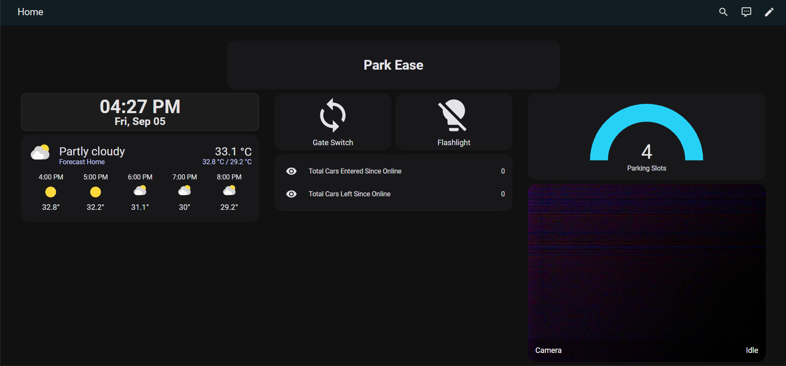
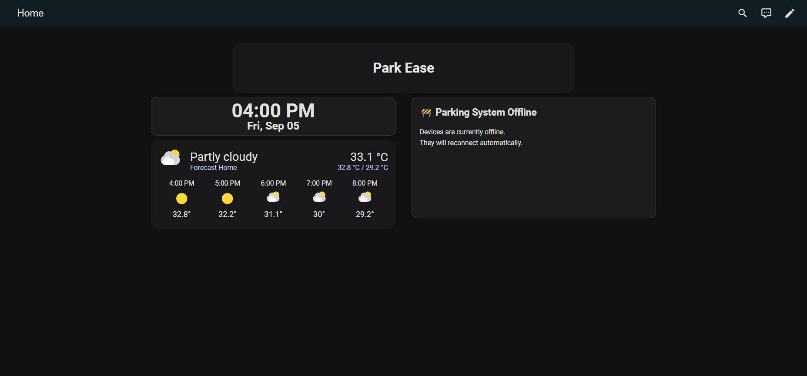
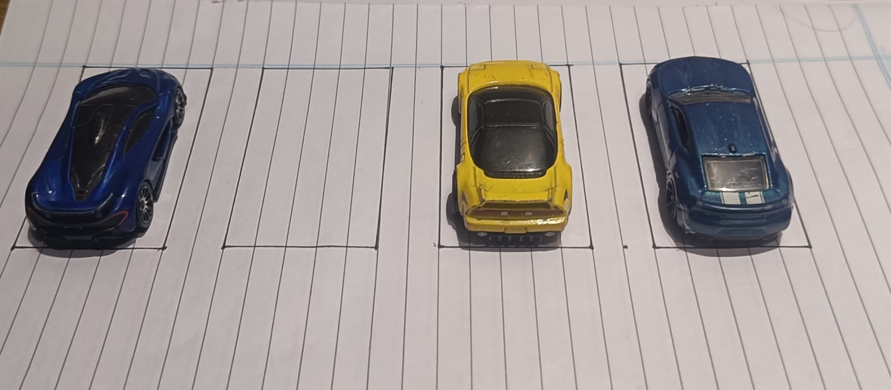
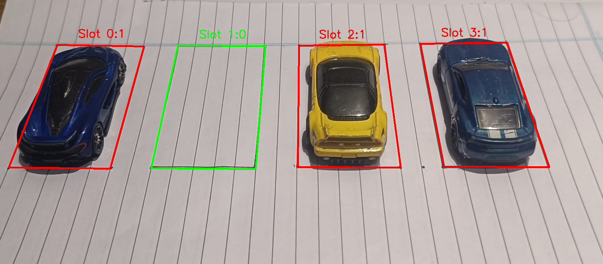
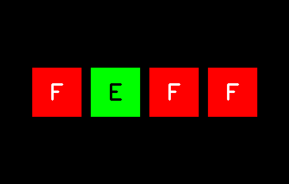

# 🚗 ParkEase - ESPHome Parking Automation

**ParkEase** is a smart parking automation project powered by **ESPHome** and **Home Assistant**, designed to automate gate access and monitor parking occupancy. It combines real-time sensor data, camera surveillance, and computer vision to offer an intelligent parking solution.

## 📦 Features

- 🔌 Built with ESPHome for simple configuration and OTA updates
- 📊 Real-time occupancy detection using ultrasonic or IR sensors
- 📸 Surveillance camera support (for security and slot detection)
- 🚪 Automated gate opening/closing using servo or relay
- 🧠 Seamless integration with Home Assistant dashboard
- 📈 Designed for future ML-based slot detection
- 🔧 Modular and easily expandable hardware/software setup

## 🛠 Hardware Requirements

- ESP8266 board
- Ultrasonic sensor (e.g., HC-SR04) or IR proximity sensor
- Servo motor / Relay module (for gate control)
- ESP32-CAM
- Optional: RFID reader, LED indicators, buzzer, etc.

## 🧾 Installation

1. Clone the repository:
   ```bash
   git clone https://github.com/YJuDeAd/ParkEase-ESPHome.git
   ````

2. Configure the ESPHome YAML files:

   * `parkEase.yaml`: Main automation logic for sensors and gate
   * `cam.yaml`: Camera integration for surveillance and slot tracking

3. Flash to your ESP boards using ESPHome:

   ```bash
   esphome run parkEase.yaml
   esphome run cam.yaml
   ```

4. Add devices to Home Assistant using the ESPHome integration.

## 📁 Repository Structure

| File/Folder            | Description                                               |
| ---------------------- | --------------------------------------------------------- |
| `parkEase.yaml`        | Main ESPHome config for gate + sensor-based parking logic |
| `cam.yaml`             | ESPHome config for camera surveillance                    |
| `dashboard.yaml`       | Home Assistant dashboard layout                           |
| `carDetectionModel/` | (In progress) ML model for detecting empty/occupied slots |
| `Images/`              | Example images (dashboards, test inputs/outputs)          |
| `CONTRIBUTION.md`      | Contribution guidelines for developers                    |
| `secrets.yaml`         | Wi-Fi and API credentials (optional, not committed)       |
| `README.md`            | Project overview and documentation                        |


## 🧠 AI Model (Car Detection)  

This project uses a **YOLOv8x segmentation model** to detect parked cars and identify empty slots.  

Because the model file is greater than 100 MB, it's not included directly in this repository.  

```
carDetectionModel/
├── yolo8x-seg.pt
├── display.py
├── imgRecon.py
└── main.py
```

## 🖼️ Examples / Demo

### 📊 Home Assistant Dashboard

#### ✅ System Online


#### ❌ System Offline


---

### 🧪 Car Detection (YOLOv8 Segmentation)

#### 🔹 Input Test Image


#### 🔹 Detection Result


#### 🔹 Available Slots


## 📚 References

* [ESPHome Documentation](https://esphome.io/)
* [Home Assistant Documentation](https://www.home-assistant.io/)
* [ESP32-CAM Support](https://esphome.io/components/esp32_camera.html)
* [YOLOv8 for Object Detection (example)](https://docs.ultralytics.com/models/yolov8/)

## 🎯 Future Enhancements

* 🧠 Integrate computer vision with camera feed to detect empty slots
* 📍 Map camera detection to specific parking slot IDs
* 🔔 Add alerts/notifications for slot status or gate activity
* 🌐 Add MQTT support for broader IoT ecosystem compatibility
* 🔒 RFID/QR-based access control

## 🧑‍💻 Author

Developed by [YJuDeAd](https://github.com/YJuDeAd), [inderjot249](https://github.com/inderjot249) and [KrishnaKangotra](https://github.com/KrishnaKangotra)
